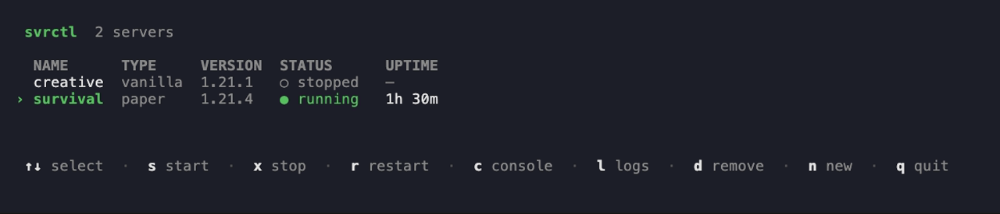

# svrctl

A CLI for running local Minecraft servers — create, start, stop, and watch
them without hand-managing jars, Java versions, or `screen` sessions.



Run `svrctl` with no arguments to open that dashboard. The main list keeps to
lifecycle actions — start, stop, restart, remove, create. Press `enter` on a
server to open its own dashboard, which handles everything specific to it:
console, logs, editing memory/port, browsing and editing server.properties,
creating/restoring backups, and searching, installing, updating, and removing
plugins on a paper server. Everything below also works as a plain command,
for scripts and muscle memory.

## Install

Requires Go 1.26+.

```
go install github.com/adammcgrogan/svrctl/cmd/svrctl@latest
```

Or build from a checkout:

```
git clone https://github.com/adammcgrogan/svrctl
cd svrctl
go build -o svrctl ./cmd/svrctl
```

## Quick start

```
svrctl create survival --type paper --version 1.21.4 --accept-eula
svrctl start survival
svrctl console survival
```

Or just run `svrctl create` on a terminal and answer the questions — it walks
you through picking a type, a real published version, memory, and a port.

## Commands

| Command | Does |
|---|---|
| `svrctl create [name]` | Set up a new server — downloads the jar, installs the Java version it needs, registers it |
| `svrctl list` | List your servers |
| `svrctl status <name>` | Show everything about one server |
| `svrctl start <name>` | Start a server in the background (`--attach` to stay in the foreground) |
| `svrctl stop <name>` | Stop a running server (`--force` to kill it, `--timeout` to adjust the grace period) |
| `svrctl restart <name>` | Stop and start it |
| `svrctl console <name>` | Attach to a running server's console, scrollback and all |
| `svrctl cmd <name> <command...>` | Send one command without attaching |
| `svrctl logs <name>` | Show recent output (`-f` to follow, `-n` for how much) |
| `svrctl versions` | List Minecraft versions you can pass to `create --version` |
| `svrctl edit <name>` | Change a server's memory or port after creation |
| `svrctl properties <name> [key] [value]` | List, get, or set `server.properties` settings |
| `svrctl backup create/list/restore <name>` | Snapshot and restore a server's world data |
| `svrctl plugin search/install/list/update/remove` | Manage Modrinth plugins on a paper server |
| `svrctl remove <name>` | Unregister a server (`--purge` to also delete its files) |

`start`, `stop`, `restart`, `list`, and `status` all take `--group <name>` instead of a
server name, to act on every server tagged with `svrctl create --group`/`svrctl edit
--group` at once — handy for a proxy plus its backend servers.

Every command takes `--json` where a machine might read the output, and
`--plain` disables colour and interactive screens globally.

## Where things live

svrctl keeps three things on disk, all in OS-standard locations:

- **`servers.yaml`** — the registry of what you've created, under your user
  config directory (e.g. `~/Library/Application Support/svrctl` on macOS,
  `~/.config/svrctl` on Linux, `%AppData%\svrctl` on Windows).
- **Cached JDKs and server jars** — under your user cache directory, so a
  second server on the same Java version doesn't download it twice.
- **Server files** — `~/mcservers/<name>` by default, or wherever `--path`
  points.

## Scope

Runs on macOS, Linux, and Windows. Vanilla and Paper are supported today.
Plugin management (`svrctl plugin`) works on paper servers via Modrinth; no
mod loader (Fabric/Forge) support yet.
